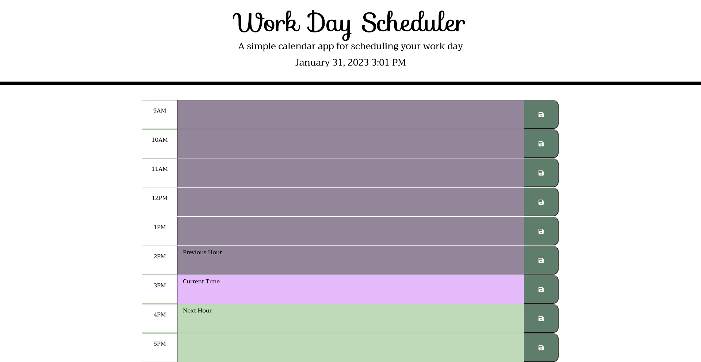

# Planner-app
This is a simple calendar application that allows a user to save events for each hour of the day by modifying starter code.

## The Respository

* AS AN employee with a busy schedule

* I WANT to add important events to a daily planner

* SO THAT I can manage my time effectively

 

## Instructions

The appplication: Deployed Link: https://chloehill3.github.io/Planner-app/

* Displays the current day at the top of the calendar when a user opens the planner.

* Present timeblocks for standard business hours when the user scrolls down.

* Color-code each timeblock based on past, present, and future when the timeblock is viewed.

* Allow a user to enter an event when they click a timeblock.

* Save the event in local storage when the save button is clicked in that timeblock.

 

## Example

 
 
---

## License

© 2023 Chloe Hill. All Rights Reserved.

Licensed under the [MIT](/LICENSE) license.
